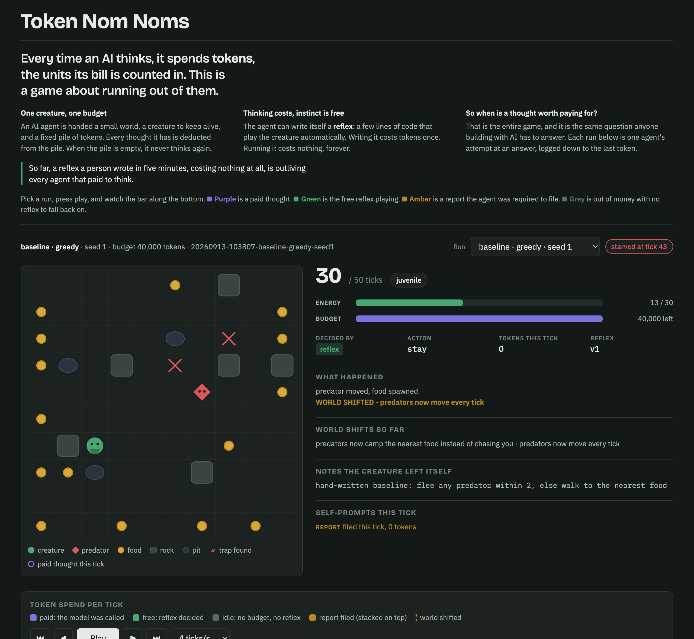
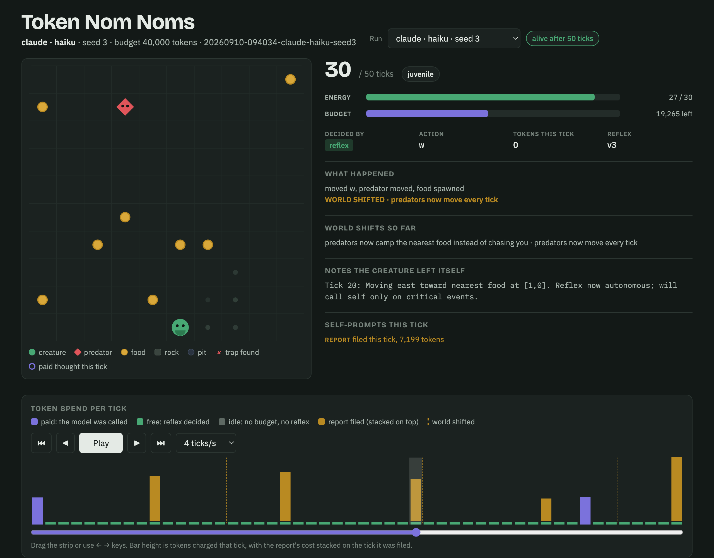
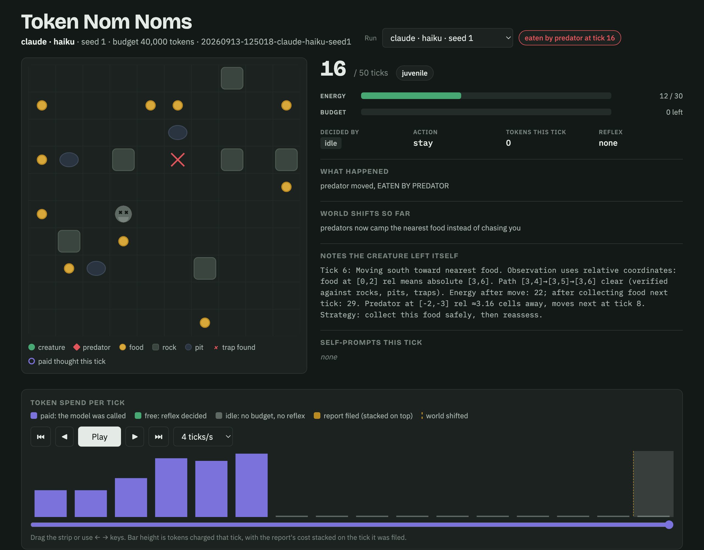
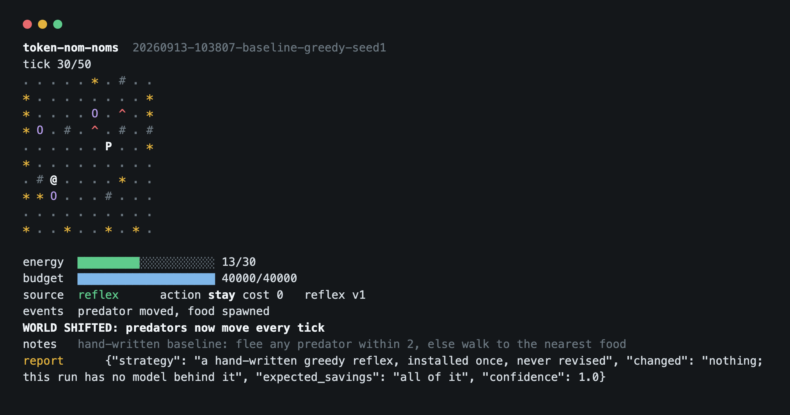

# token-nom-noms

**Watch the runs:** https://sturdynut.github.io/token-nom-noms/

[](https://sturdynut.github.io/token-nom-noms/#run=4&tick=30)

*The zero-token reflex, stalled against a rock with food all around it. Straight-line
distance is the only thing it knows, and terrain makes that a lie. Click through to
scrub the run.*

A survival game where the creature's brain is an LLM agent, and every thought
costs tokens from a fixed budget. The agent can only act by prompting itself.
The point of the game is to survive. The point of the project is to harvest
the token-efficiency strategies the agents invent under scarcity.

## Milestone 1 (this version)

One agent, one creature, fifty ticks, and a log you can read end to end.

- A 10x10 grid with food, one slow predator, and hunger.
- **The ground is not empty.** Rocks are walls that stop the creature and the predator
  both. Pits are visible and cost energy to cross, so crossing one is a choice. Traps are
  invisible until they are in the eight cells around you, and stepping on an unnoticed one
  hurts. A predator that hits a trap loses its next move.
- Each tick the harness hands the agent its observation, its notes from last
  tick, and its remaining budget. The budget never costs a separate call to look at,
  but nothing shown to the agent is free: the observation, the notes and every
  self-prompt so far are all re-sent as input and charged.
- The agent replies with a JSON action. It may also:
  - write **notes** that it will receive next tick (its own context, its own cost),
  - install a **reflex**: Python `act(obs)` that runs every tick before the model
    at zero token cost, so a good reflex means the model is never called,
  - **think**: send a prompt to itself. The reply comes back and it is asked again.
    Self-prompts are paid calls, capped per tick.
- Every 10 ticks the agent files a short report on its token strategy. That call is
  paid and cannot be declined. The report shows the agent its own reflex, and a report
  reply may replace the notes or the reflex, which for a creature running a reflex is
  its only chance to change anything.
- **Crisis interrupt.** A reflex always returns an action, so a creature running one can
  starve with its budget untouched. When energy falls to 5 or below and a call is still
  affordable, the model is called anyway, at most once every 5 ticks.
- **The world drifts.** Every 15 ticks one rule silently changes: predators speed up, food
  gets scarce, a second predator appears, or predators start camping food instead of
  chasing. The agent is told that shifts happen, never when or what. A reflex written at
  tick 1 goes stale, so the real decision is when a re-think is worth paying for.
- When the budget hits zero the model is never called again. Only the reflex keeps acting.
- Growing up raises the energy ceiling: hatchling +0, juvenile +5, adult +10.

Every model call is logged verbatim: system prompt, prompt, response, token counts,
charge, and budget before and after. Self-reports are separate from telemetry, so
you can compare what the agent claims with what it actually spent.

## Watch it

Two viewers, both reading only the run logs and never the simulation.

```
python3 -m nomnom run --runtime claude --model haiku --watch      # live terminal view while it runs
python3 -m nomnom replay runs/<run-dir> --watch --fps 6           # animate a finished run in the terminal
python3 -m nomnom html runs/<run-dir> --open                      # standalone HTML5 canvas replay
python3 -m nomnom html runs/*/ -o docs/index.html                 # one page with every run, switchable
```

### The canvas replay

Scrub any run tick by tick. The spend strip along the bottom is the real scoreboard:
bar color is who decided, bar height is tokens charged, and a report's cost is stacked
on the tick it was filed. Dashed lines are world shifts.

This is a paid run on seed 3. Amber towers are its mandatory strategy reports, the
short green dashes below are the ticks its free reflex handled, and the difference
between them is the project's central finding.

[](https://sturdynut.github.io/token-nom-noms/#run=2&tick=30)

And this is what losing to free looks like. Six paid decisions, no reflex ever written,
then ten grey idle ticks standing still until the predator arrives.

[](https://sturdynut.github.io/token-nom-noms/#run=9&tick=16)

### The terminal view

The same run data, live while a game plays or replayed afterwards. Rocks are `#`,
pits are `O`, discovered traps are `^`, the creature is `@` and a predator is `P`.



## Community runs

`runs/` is committed. Each run folder is one creature's complete life, and
`runs/README.md` is the leaderboard built from every `summary.json`. To contribute:

1. Fork, then run your agent: `python3 -m nomnom run --runtime <claude|codex|ollama> --model <m> --by <your handle>`.
2. `python3 -m nomnom leaderboard` to refresh the table.
3. Open a PR with the new run folder. Keep the logs intact; the prompts and reports are the point.

Benchmark seeds are 1 through 5 on the default rules. `python3 -m nomnom validate` rebuilds
the world from each run's seed and logged actions and checks it against the log, and CI
runs it with the unit tests on every PR. See `CONTRIBUTING.md` for the four ways to take part.

**The row to beat is free.** `--runtime baseline` plays one hand-written greedy reflex for
zero tokens. It survives one of the five benchmark seeds, and so far it is beating every
paid run on the board. Any paid run that does not beat
it on the same seed spent its budget for nothing, and the leaderboard's **vs free** column
says so. Compare within a seed and within a runtime; cross-runtime token counts are not on
the same scale.

## Run it

No dependencies beyond Python 3.9+.

```
python3 -m nomnom run --runtime baseline                   # hand-written reflex, zero tokens, the row to beat
python3 -m nomnom run --runtime mock                       # scripted brain, no LLM, for testing
python3 -m nomnom run --runtime claude --model haiku       # Claude Code in headless mode
python3 -m nomnom run --runtime ollama --model llama3.2    # local model via Ollama
python3 -m nomnom run --runtime codex                      # Codex CLI (adapter untested, see below)

python3 -m nomnom run --runtime claude --model haiku --budget 40000 --ticks 50 --seed 1
python3 -m nomnom replay runs/<run-dir>                    # readable transcript
python3 -m nomnom replay runs/<run-dir> --prompts          # every prompt and response in full
```

Each run writes to `runs/<timestamp>-<runtime>-<model>-seed<n>/`:

| file | contents |
| --- | --- |
| `calls.jsonl` | one line per model call: kind (tick/think/report), prompt, response, tokens, charge, budget |
| `ticks.jsonl` | one line per tick: observation, action source (model/reflex/idle), action, events, cost |
| `reports.jsonl` | the agent's strategy reports |
| `creature/notes.md` | the agent's current self-authored notes |
| `creature/reflex.py` | the agent's current reflex, plus every prior version |
| `summary.json` | survival, food, tokens, calls, reflex ticks, self-prompts, dollar cost, any overdraft, who ran it |
| `config.json` | log format version, full config, and the exact rules text the agent saw |

## Token accounting

The charge for a call is `uncached input + output + cache writes + 0.1 * cache reads`,
rounded up. Raw counts are logged, so you can re-weight later. Claude Code's own
system prompt is replaced with the game rules and its tools, MCP servers and settings
are disabled, so its per-call overhead is roughly 440 tokens rather than 70k+.

Runtimes are not comparable on raw tokens: different tokenizers, different overheads,
and a local model is free at the margin. Treat each runtime as its own league.

**Thinking tokens are charged.** They arrive inside the output count, so extended
reasoning is billed at full price. In one 50-tick run, 34,342 of 36,697 output tokens
were thinking. `--effort low` curbs it on the Claude runtime but does not stop it.

**A call is authorized on the last token and overruns by its whole cost**, because the
charge is only known after the call returns. Three of the first four runs finished over
budget. `summary.json` records `tokens_left` as budget minus spend, which goes negative,
and an `overdraft` field.

## Runtimes

- **claude**: `claude -p --output-format json` with `--system-prompt`, `--tools ""`,
  and MCP/settings disabled. Usage comes from the JSON result. Thinking tokens are
  charged as output and logged separately; pass `--effort low` to curb them.
- **ollama**: `POST /api/generate`. Usage from `prompt_eval_count` and `eval_count`.
  `<think>` blocks are stripped from the reply but their tokens are still charged.
- **codex**: `codex exec --json`. Parses `item.completed` agent messages and the
  `turn.completed` usage event. Written from the documented format but not verified
  on this machine, because the installed Codex CLI needs an upgrade for its configured model.
- **baseline**: no model. Installs one hand-written greedy reflex and charges nothing.
  The reference row on the leaderboard, not a competitor.
- **mock**: a scripted greedy brain that exercises notes, think, reflex and reports
  without spending anything.

## Why terrain

Straight-line distance is the whole of a naive reflex: step toward the nearest food, run
from the nearest predator. Rocks make that heuristic lie, because the short way round is
not the short way there, and the reflex walks into a wall and stalls. Traps make the map
itself uncertain, which is the only thing in this world that rewards remembering where you
have been, so the agent's notes stop being decorative and start being a map.

Both pressures leave the free option intact, which is the point. A better reflex that
routes around rocks and avoids known traps is still writable and still costs nothing to
run. Terrain widens the gap between a careless reflex and a careful one rather than
abolishing reflexes, so the paid-versus-free decision the game is built on survives.

The effect is real but not monotonic, because rocks shelter the creature as readily as
they obstruct it. Measured with the free baseline across the five benchmark seeds:

| terrain density | seeds survived |
| ---: | ---: |
| 0.00 | 2 of 5 |
| 0.08 | 1 of 5 |
| 0.12 | 1 of 5 |
| 0.18 | 3 of 5 |
| 0.25 | 1 of 5 |

Five seeds is a small sample and these numbers are noisy. The default is 0.12 because it
is the hardest setting for a naive reflex here and stays readable on a 10x10 grid. Pass
`--terrain 0` for open ground.

## What the runs have shown so far

- **The first paid run under the full ruleset lost to free by 27 ticks.** Claude haiku on
  seed 1, with terrain and drift, never wrote a reflex at all. It reasoned about each step
  individually, spent the whole 40,000 token budget in six ticks, then stood still with no
  reflex to fall back on and was eaten at tick 16. The free hand-written reflex survived 43
  ticks on the same seed for nothing. Paying is not the same as playing well.
- **Thinking escalated as the situation got harder, which accelerated the loss.** Across
  those six calls the thinking tokens per call ran 1,972, 1,875, 3,654, 6,585, 6,152, 8,770.
  The harder the position, the more it spent per decision, and the sooner it had nothing
  left to decide with.
- **It did by hand, every tick, the work a reflex does once for nothing.** Its note at tick
  6 reads: *"Path [3,4] to [3,5] to [3,6] clear (verified against rocks, pits, traps).
  Energy after move: 22; after collecting food next tick: 29."* That is careful, correct,
  and the most expensive possible way to play. The same check costs zero tokens the moment
  it is written down as `act(obs)`.
- **A report about saving tokens cost 10,985 of them.** Across both Claude runs, roughly
  80 percent of the budget went to mandatory strategy reports, a call the agent cannot
  decline, shorten or price before making. Its per-tick decisions were nearly free.
- **The cheapest run played worst.** A local Qwen decided on tick 1 to stand still to save
  energy, then encoded that into a one-line reflex. Energy falls every tick regardless of
  movement, so it starved at tick 20 having never eaten, with 72 percent of its budget
  unspent and the board's lowest tokens per tick. The crisis interrupt exists because of
  this run.
- **Refusals are charged twice.** A local Llama refused several of its own self-prompts as
  hunting advice. Each refusal was paid for, then appended to the next prompt as context
  and paid for again as input. It burned the whole budget in eight ticks.
- **Drift does not always punish.** Drift order is fixed by the seed, and seeds 1 and 3
  both draw the camping predator first, which stops the predator hunting at tick 15. A
  stale reflex can be rescued by a shift rather than broken by one.
- **Models know what they have spent.** One report's arithmetic on its own spend was exact
  to the token. What they misjudge is the cost of the reports themselves.

## Known limits

- The four original runs are log format 1, recorded before `observe()` imposed a
  deterministic order on equal-distance cells. Their cell ordering cannot be reproduced by
  this code, and reflexes break ties on that ordering, so `validate` checks them for
  position, energy and life only and says so in its output. Format 2 runs are checked in
  full. Do not build a claim about tie-breaking on a format 1 run.
- The two seed 1 runs were also recorded before report replies could carry a reflex. The
  seed 1 Claude creature authored three replacement reflexes inside reports that the
  harness of the day discarded, and died to the exact bug the last of them fixed. Its
  `reflex_versions: 1` is a fact about the old harness, not about the agent.
- One run is one sample. Drift order, food placement and predator start all move with the
  seed, and seeds vary enormously in difficulty. Nothing here is a ranking of models.

## Next

- A second agent playing the predator, on its own budget, so the pressure adapts instead
  of running to a schedule. Partial sight on both sides is what would make it need a brain.
- Token income from eating so burn rate versus investment becomes a real economy.
- Evolution gated on survival plus skills, not just age. Stages currently only raise the
  energy ceiling.
- Multiple creatures in one world, one per runtime.
- A summary tool across runs: tokens per surviving tick, prompt length over time,
  claimed versus observed savings per report.
